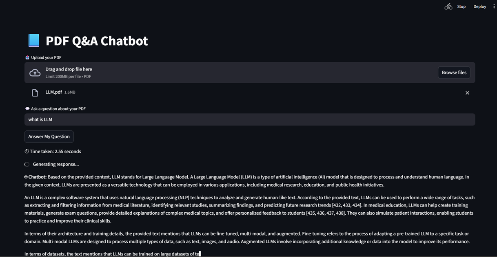

<h1 align="center">📘 PDF Q&A Chatbot (LangChain + Groq + HuggingFace + Streamlit)</h1>

<p align="center">
An <b>AI-powered PDF Question-Answering Chatbot</b> built with <b>LangChain</b>, <b>Groq Llama 3</b>, and <b>HuggingFace Embeddings</b> — all inside an interactive <b>Streamlit</b> interface.<br>
Upload any PDF, ask a question, and get detailed answers with a <b>ChatGPT-like typing effect</b>.
</p>

---

<h2>🚀 Features</h2>

<ul>
  <li>📂 <b>Upload Any PDF</b> – Instantly process any document you upload.</li>
  <li>🔍 <b>RAG-Based Q&A</b> – Retrieval-Augmented Generation ensures answers come <i>only</i> from your PDF.</li>
  <li>🧠 <b>Detailed Explanations</b> – Provides structured, multi-paragraph responses.</li>
  <li>⌨️ <b>ChatGPT-Style Typing Animation</b> – Simulated real-time typing effect.</li>
  <li>⚡ <b>Fast Vector Search</b> – FAISS handles rapid context retrieval.</li>
  <li>🎨 <b>Clean Streamlit UI</b> – Simple, modern, deployable anywhere.</li>
</ul>

---

<h2>🧠 How It Works</h2>

<ol>
  <li><b>Upload a PDF</b> → The app reads your file using <code>PyPDFLoader</code>.</li>
  <li><b>Chunking & Embeddings</b> → The file is split into smaller chunks using <code>RecursiveCharacterTextSplitter</code> and embedded via <b>HuggingFace Embeddings</b>.</li>
  <li><b>Vector Store</b> → All chunks are stored in a <b>FAISS</b> vector database.</li>
  <li><b>Ask a Question</b> → Your query is compared with document chunks to retrieve relevant context.</li>
  <li><b>Groq LLM Response</b> → The context + query is sent to <b>Llama-3.1-8B-Instant</b> for a structured, contextual answer.</li>
</ol>

---

<h2>🧩 Tech Stack</h2>

<table>
<tr><th>Component</th><th>Library / Tool</th></tr>
<tr><td>Frontend</td><td>Streamlit</td></tr>
<tr><td>LLM Backend</td><td>Groq Llama-3.1-8B-Instant</td></tr>
<tr><td>Vector Store</td><td>FAISS</td></tr>
<tr><td>Embeddings</td><td>HuggingFace Embeddings</td></tr>
<tr><td>Document Loader</td><td>LangChain PyPDFLoader</td></tr>
<tr><td>Framework</td><td>LangChain (Classic + Community Modules)</td></tr>
</table>

---

<h2>🛠️ Installation</h2>

<h3>1️⃣ Clone the Repository</h3>

```bash
git clone https://github.com/yourusername/pdf-qa-chatbot.git
cd pdf-qa-chatbot
```

<h3>2️⃣ Create a Virtual Environment</h3>

```bash
conda create -n pdf_qa python=3.10 -y
conda activate pdf_qa
```

<h3>3️⃣ Install Dependencies</h3>

Create a <b>requirements.txt</b> file with:
```txt
streamlit
langchain
langchain_groq
langchain_huggingface
langchain_community
faiss-cpu
python-dotenv
PyPDF2
```

Then run:

```bash
pip install -r requirements.txt
```

<h3>4️⃣ Setup Environment Variables</h3>

Create a file named <b>.env</b> in your root directory:
```env
GROQ_API_KEY=your_groq_api_key_here
HF_TOKEN=your_huggingface_token_here
```

👉 Get your keys from:

<ul> <li><a href="https://console.groq.com/keys">Groq Cloud API Key</a></li> <li><a href="https://huggingface.co/settings/tokens">HuggingFace Access Token</a></li> </ul>

<h2>▶️ Run the App</h2>

```bash
streamlit run app2.py
```

Then open: <a href="http://localhost:8501">http://localhost:8501
</a>

<h2>💡 Usage</h2> <ol> <li>Click <b>📤 Upload your PDF</b> and select a document.</li> <li>Wait while embeddings are generated.</li> <li>Ask a question such as: <ul> <li>“Summarize the introduction section.”</li> <li>“What methods were used in this research?”</li> <li>“What are the main findings?”</li> </ul> </li> <li>The chatbot responds with a detailed, animated answer.</li> <li>Expand <b>📚 Retrieved Context</b> to view the exact document snippets used.</li> </ol>

<h2>📦 Folder Structure</h2>

```bash
📦 pdf-qa-chatbot
├── app2.py                # Main Streamlit app
├── .env                   # API keys (ignored by git)
├── requirements.txt        # Dependencies
├── README.md               # Documentation
└── temp_uploaded.pdf       # Temporary uploaded file
```

<h2>✨ Example Output</h2> <blockquote> <b>User:</b> Explain the main conclusion of the paper.<br><br> <b>🤖 Chatbot:</b> The paper concludes that neural network optimization improves model accuracy through adaptive gradient methods like Adam and RMSprop. These methods effectively balance convergence and generalization, resulting in superior performance across various datasets.▌ </blockquote>

---

<h2>📷 Dashboard Preview</h2>

<p align="center">
  
</p>

<p align="center">
  <i>Example interface of the Streamlit-based PDF Q&A Chatbot.</i>
</p>

---


<h2>🧭 Future Improvements</h2> <ul> <li>🧠 Add chat memory for multi-turn conversations.</li> <li>📚 Support multiple PDF uploads.</li> <li>💾 Persistent FAISS vector caching.</li> <li>🌐 Deploy on Streamlit Cloud or Hugging Face Spaces.</li> <li>🎤 Add voice input and text-to-speech support.</li> </ul>

<h2>💖 Acknowledgements</h2> <p>Special thanks to:</p> <ul> <li><a href="https://www.langchain.com/">LangChain</a> – modular AI orchestration</li> <li><a href="https://groq.com/">Groq Cloud</a> – ultra-fast inference engine</li> <li><a href="https://huggingface.co/">HuggingFace</a> – embedding models</li> <li><a href="https://streamlit.io/">Streamlit</a> – easy interactive app building</li> </ul>

<h2>👨‍💻 Author</h2> <p><b>Arvinth Athikesav</b><br> 🚀 Passionate about Generative AI, LangChain, and LLM Applications.<br> 📫 Connect on <a href="https://github.com/arvinth186">GitHub</a> </p> 


